# Probe_Design_ver1
Probe design method for in situ HCR method (ver1)

# How to design the probes using the scripts

## 1. Obtain reference sequence from NCBI

Example1, Gad1 gene, mRNA reference sequence NM_008077.5, 3283 bp

https://www.ncbi.nlm.nih.gov/nuccore/NM_008077.5

FASTA sequence
>NM_008077.5 Mus musculus glutamate decarboxylase 1 (Gad1), transcript variant 1, mRNA
GCCTCCCCCAAGCCCAGCGGCCGCCTCTCCGGATCTCTCCCTTCTTCAGGCTCTCCCGTGCCGGACCAGG
GATCGTGCAAGCAAGGAAGCAGCCCTGGGGTGACACCCAGCACGTACTCCTGTGACAGAGCCGAGCCCAG
CCCAGCCCCGGGACGCTTCGCAGAGGAGTCGCGGGAGGGTCCAGCTCGCTGTCGCTGAACCGAGCCTGTT
CCTGCGCCCAGTCTGCGGGGGACCCTTGAACCGTAGAGACCCCAAGACCACCGAGCTGATGGCATCTTCC
ACTCCTTCGCCTGCAACCTCCTCGAACGCGGGAGCGGATCCTAATACTACCAACCTGCGCCCTACAACGT
ATGATACTTGGTGTGGCGTAGCCCATGGATGCACCAGAAAACTGGGCCTGAAGATCTGTGGCTTCTTACA
AAGGACCAATAGCCTGGAAGAGAAGAGTCGTCTTGTGAGCGCCTTCAGGGAGAGGCAGTCCTCCAAGAAC
CTGCTTTCCTGTGAAAACAGTGACCAGGGTGCCCGCTTCCGGCGCACAGAGACCGACTTCTCCAACCTGT
TTGCTCAAGATCTGCTTCCAGCTAAGAACGGGGAGGAGCAAACTGCGCAGTTCTTGCTGGAAGTGGTAGA
CATACTCCTCAACTATGTCCGCAAGACATTTGATCGCTCCACCAAGGTTCTGGATTTCCACCACCCACAC
CAGTTGCTGGAAGGCATGGAAGGCTTTAATTTGGAGCTGTCTGACCACCCCGAGTCTCTGGAGCAGATCC
TGGTTGACTGTAGAGACACCCTGAAGTACGGGGTTCGCACAGGTCACCCTCGATTTTTCAACCAGCTCTC
TACTGGTTTGGATATCATTGGTTTAGCTGGTGAATGGCTGACATCGACTGCCAATACCAATATGTTCACA
TATGAAATTGCACCCGTGTTTGTTCTCATGGAACAGATTACTCTTAAGAAGATGAGAGAGATCGTTGGAT
GGTCAAATAAAGATGGTGATGGGATATTTTCTCCTGGGGGAGCCATATCCAATATGTACAGCATCATGGC
TGCTCGTTACAAGTACTTCCCAGAAGTGAAGACAAAAGGCATGGCGGCTGTGCCCAAACTGGTCCTCTTC
ACCTCAGAACACAGTCACTATTCCATAAAGAAAGCCGGGGCTGCGCTTGGCTTTGGAACCGACAATGTGA
TTTTGATAAAGTGCAATGAAAGGGGGAAGATAATTCCGGCTGATTTAGAGGCAAAAATTCTTGATGCCAA
ACAAAAGGGCTATGTTCCCCTTTATGTCAATGCAACCGCAGGCACGACTGTTTACGGAGCATTCGATCCA
ATCCAGGAAATTGCGGACATATGTGAGAAATACAACCTTTGGCTGCATGTGGATGCTGCCTGGGGTGGTG
GACTGCTCATGTCCCGGAAGCACCGCCACAAACTCAGCGGCATAGAAAGGGCCAATTCAGTCACCTGGAA
CCCTCACAAGATGATGGGCGTGCTGCTCCAGTGCTCTGCCATTCTGGTCAAGGAAAAGGGTATACTCCAA
GGATGCAACCAGATGTGTGCAGGCTACCTCTTCCAGCCAGACAAGCAGTATGACGTCTCCTATGACACCG
GGGACAAGGCGATTCAGTGTGGCCGCCATGTGGACATCTTCAAGTTCTGGCTGATGTGGAAAGCAAAGGG
CACCGTGGGATTTGAAAACCAGATCAACAAATGCCTGGAGCTGGCTGATTACCTCTACGCCAAGATTAAA
AACAGAGAAGAGTTTGAGATGGTTTTCGATGGTGAGCCTGAGCACACAAATGTCTGTTTCTGGTACATTC
CACAAAGCCTTCGAGGGGTTCCAGATAGCCCTGAGCGACGAGAAAAGCTACACAGGGTGGCTCCCAAGAT
CAAAGCTCTGATGATGGAGTCAGGAACAACCATGGTGGGCTACCAGCCTCAAGGGGACAAGGCCAACTTC
TTCCGGATGGTCATCTCTAACCCAGCCGCCACCCAGTCTGACATCGATTTCCTCATTGAGGAGATAGAGA
GGTTGGGTCAGGATCTGTAATCCCTCTTTACAGAACCAGAATCATCGGCCATGCTTGTGCCCCTCTGGTA
CCCTAGAGCACAGCTCTGTCAGTAGCTGACACATCTAGGCCATCTCACTGAAGGAAATTACAATCTCTTA
AAGAATATTTGTCACATTTCACATAAGCTTGTTTGTTAGAGCTAGTGGGGAAATAATGTTCTTTTTAAAA
AATTGCACATTAGAAACACAGTATATATGTACAGTTATATATACCTCTCTCTATGTACATGTATGTATAG
TGACTGTGGCTTAGTCCTAGACCATAGCATGTTGCTCGTCCCCAGGAAATTAGCCTTACCCCCAGCAATT
ACTAAGAGGCTAAACCATCTCGCAAGCAACTACAGGGCGGATGGTATCCCTACTGCAGTGTCCTAGGGAC
CCAGGGAAAGGCTGTTGGTGGGAGGCTACCTCCCTGCTAGAGCTGTTCCCACGTGAAGGGATGATGGATG
ACAGATGTACCAGTAAATGACAAATGTCACACCCTCCCTGTTAGTACCCTGCTAGGGGAAATAGTAGCAG
TCTTTGTCACAATTGTGCTTTGCTGTGTTTTAGAGATTAATCTGTGTAAACTGTGTACATTGCCATTGTC
TATCTTTGGGCAGGGGGAAGTGCATATAATGATTAAATTGTATGTCAGTGAGATATCTGCTTATTTATAT
TCAAATATATACCATGTTAAAGAGACATCTTGTATTTTCTTCCCATTTGTAATGTATCTTATTTATATAT
TAATGGAGTAAGTTCTGGATACTGTTTATGGTATTTTCGTGCATTTGTGAGCCAAAGAGAAAAGATGAAA
ATTAGTGAGATTTGCATTTATATTAGAGTGCCCTTAACATAATGATTTGAACATATGTGTACTGTCTGGA
AAAGAATTCTGATACTGTACATAGAGTCATGTTATGGAAATCTTGCTTCAGTAGCCTTCGCTCTTCTCTT
TCCCCCCTCAGGCTGTATGTCAGATGTTCTCAAAGCTTTTCTAGTAACTGTTGAATAATAATAACTAGAT
CTCCTGTAATTTTGTAGTAGTATATGACCAATCTCTGTGACTCGCTTAGCTGAAACCTAAGGCAATGTTT
CTGAAGACCTCCGATACACTGACCAGTCCCACAAGTGTTTTTGAAGACATGAAACCCACACTGTGCATTT
AGGGTGTGCAAGAAGAATATAAATAAAATAAAAAATATTCTCCATGAAAAAAAAAAAAAAAAA

Example2, Tph2 gene, mRNA reference sequence NM_173391.3, 2626 bp

https://www.ncbi.nlm.nih.gov/nuccore/NM_173391.3

FASTA sequence
>NM_173391.3 Mus musculus tryptophan hydroxylase 2 (Tph2), mRNA
CACTGCTCTTCAGCACCAGGGTTCTGGACAGCGCCCCGAGCAGGCAGCTGCCACTGCAGTTCCTCCTTCA
TCTCTGCCAAGGCCGCCCCTCTGGTCCCCCCTGCTGCTGAGAAAGAAAATTACATCGGGAGCCATGCAGC
CCGCAATGATGATGTTTTCCAGTAAATACTGGGCCAGGAGAGGGTTGTCCTTGGATTCTGCTGTGCCAGA
AGATCATCAGCTACTTGGCAGCTTAACACAAAATAAGGCTATCAAAAGCGAGGACAAGAAAAGCGGCAAA
GAGCCCGGCAAAGGCGACACCACAGAGAGCAGCAAGACAGCGGTAGTGTTCTCCTTGAAGAATGAAGTTG
GTGGGCTGGTGAAAGCACTTAGACTATTCCAGGAAAAACATGTCAACATGCTTCATATCGAATCCAGGAG
GTCCCGACGAAGAAGTTCTGAAGTCGAAATCTTCGTGGACTGCGAATGTGGCAAAACGGAATTCAATGAG
CTCATCCAGTTGCTGAAATTTCAGACCACCATTGTGACCCTGAATCCGCCTGAGAGCATTTGGACGGAGG
AAGAAGATCTCGAGGATGTGCCGTGGTTCCCTCGGAAGATCTCTGAGTTAGACAGATGCTCTCACCGAGT
CCTCATGTACGGCACCGAGCTTGATGCCGACCATCCAGGATTTAAGGACAATGTCTATCGACAGAGGAGG
AAGTATTTTGTGGATGTGGCCATGGGCTATAAATATGGTCAGCCCATTCCCAGGGTCGAGTACACAGAAG
AAGAGACTAAAACTTGGGGTGTTGTGTTCCGGGAGCTCTCCAAACTCTACCCGACTCATGCTTGCCGGGA
GTACCTGAAAAACCTCCCCCTGCTGACCAAGTACTGTGGCTACAGGGAAGACAACGTGCCGCAACTGGAA
GACGTCTCCATGTTTCTGAAAGAGCGATCTGGCTTCACAGTGAGACCAGTGGCTGGCTACCTGAGCCCAA
GAGACTTCCTGGCGGGCCTGGCCTACAGAGTATTCCACTGCACCCAGTACGTGCGGCATGGCTCCGACCC
CCTCTACACCCCGGAACCAGATACATGCCATGAACTCTTGGGACACGTGCCACTGCTTGCGGATCCCAAG
TTTGCTCAGTTTTCCCAAGAGATAGGCTTAGCGTCTCTGGGAGCCTCAGATGAGGACGTTCAGAAACTAG
CCACGTGCTATTTCTTCACAATCGAGTTCGGCCTTTGCAAGCAAGAGGGTCAACTGCGGGCGTATGGAGC
AGGGTTACTTTCGTCCATCGGAGAATTGAAGCATGCTCTTTCCGACAAGGCGTGTGTGAAATCCTTTGAC
CCAAAGACGACCTGCTTGCAGGAATGCCTAATCACCACCTTTCAGGACGCTTACTTTGTTTCGGACAGTT
TTGAAGAAGCCAAAGAAAAGATGAGGGACTTTGCAAAGTCAATTACCCGTCCCTTCTCGGTATACTTCAA
CCCCTACACGCAGAGCATTGAAATTCTGAAAGACACCAGAAGTATTGAGAATGTGGTGCAGGACCTGCGC
AGTGATTTGAACACAGTGTGTGATGCCTTGAATAAAATGAACCAATATCTGGGGATTTGATGCCTAGAAC
CAGAGTTATTGTCAGCATGAGCTCTTGGGGGGTGTAGCAACAATGCAGTCAATGTTATCCAACATCAACA
ACTTTCTGTGTCATGGTTGGCTAGTAAGCATGCAATTCTGTATGTCCATACCTCTGTGTAACTTAATAAC
ACAAAAATGCTCTAAAGAACCCATGCAGATAACCACTCACCATTTGAAAGATTGTGATCCTATTTGGACA
TCTCAAGTAGAGTTGACATTTCTGATTAGCGAACAAACTGTTAACTTAAGCAAACTGTGACTTTGAAATC
TGTAGCAAACATTCCTCGCACAATTCCAGTCGGTGAGTTGTGGAACTTTTCTTCCTTGGACCTGAGACTT
TCCTCTGTGTTCATTAGATAAAATGAAAATAGTTGGGAGGTGGTTTCTATTTTCAATAGTATCCGTGTTA
TTTGAGATAAACTAGAGTTGCTCCACGCTTTGCATCACAGCAACAAAGGATTTAATATTCTACTTCAGAA
GCTGTTCAGAAACACAGCAGTTGGGATGGATGTAGACTGAGTGTTCAGACAATGCAAGCAAAGAAAAGTT
TTGATAAACAGGATATATAGGTTGTACTGACCTCGTTGAAACCAATTTGTGGCAAGCTTCCTGAAGAGCT
TCTGGAAGGAAACACTTGAACAAAGAATATTCGGGAAGCTTAAACAGAAGGGATGAAAATCTTGGAACTG
TGAATGTATTGTTAGGATAGAGTGAATTATCACTGCAGGCTTTTGACTCCTTTTGCTTAGACTGAGAACC
TCAAATCCCACAGGGATGTAAATACCATCTCTGATTCCAAAGAGTTGGAGACGGAGTCGTAGAGAAACAA
AGGGATTTGCTTCAGTTAGGTCTGATGAGATGTGCCATGGTCATAAGCCACTGCCCTTTTATGTTGGACA
TCTGACAAGTCTACTGTAGTGTACATGCATGTTTATGTATTGACACAGAAAGAAAATTATTGCTTATAAA
ATGAATGCTTCTCAATAAACAGAATCTTGCCCCCAA

## 2. Make a probe table 
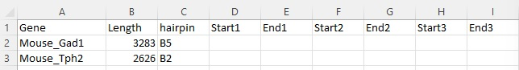

          1. Enter the length of the target RNA
          2. Enter the hairpin type you like to make

## 3. Make a folder structure
          Fasta_seq >Mouse_Gad1
                    >Mouse_Tph2

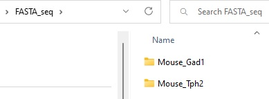

## 4. Perform BLAST sequence similarity check
https://blast.ncbi.nlm.nih.gov/Blast.cgi?PROGRAM=blastn&PAGE_TYPE=BlastSearch&LINK_LOC=blasthome

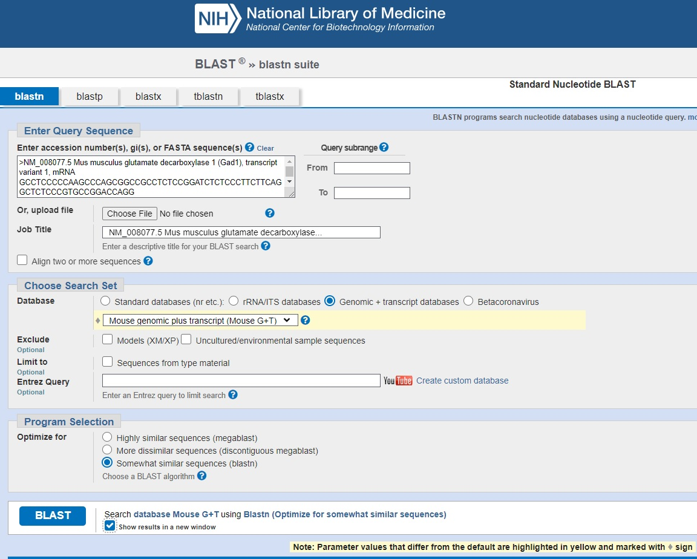

          1. Enter the fast sequence
          2. Select "Genomic + transcript databases", "Mouse genomic plus transcript (Mouse G+T)
          3. Optimized for "Somewhat similar sequences (blastn)
          4. Other setting is default

## 5. Download hit table file and specify the regions which are not used for probe design

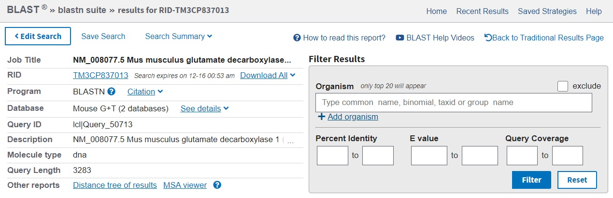
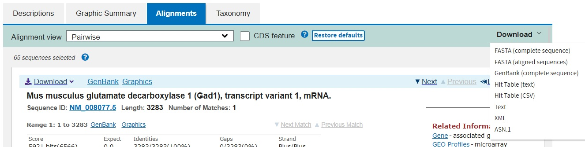

          Download hit table from the download button on the right top corner

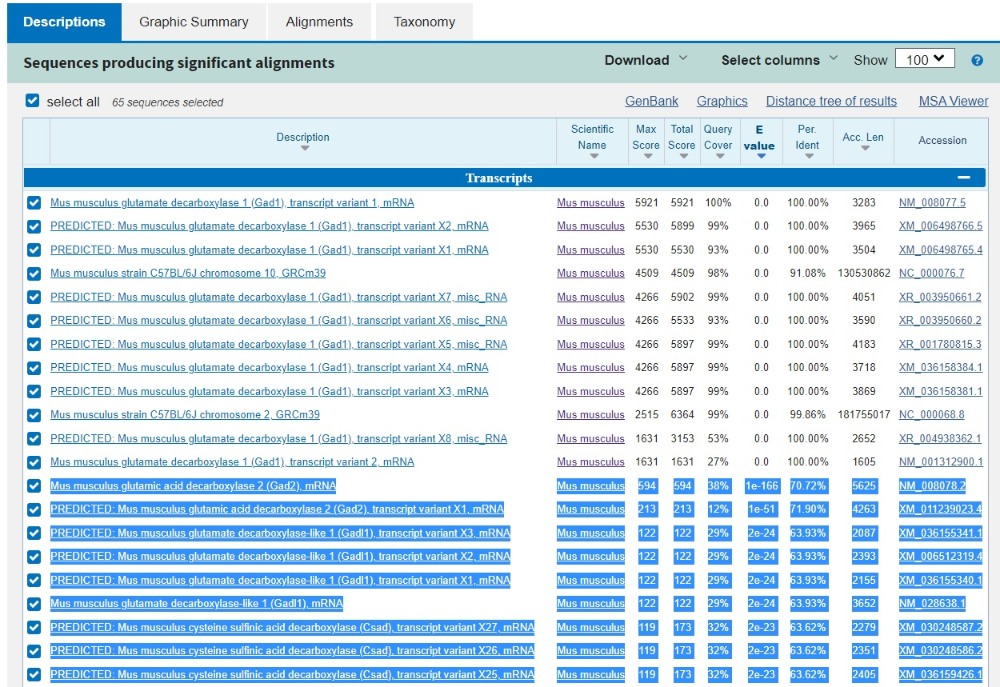

          Confirm what transcripts you want to remove (in this case after Gad2)          

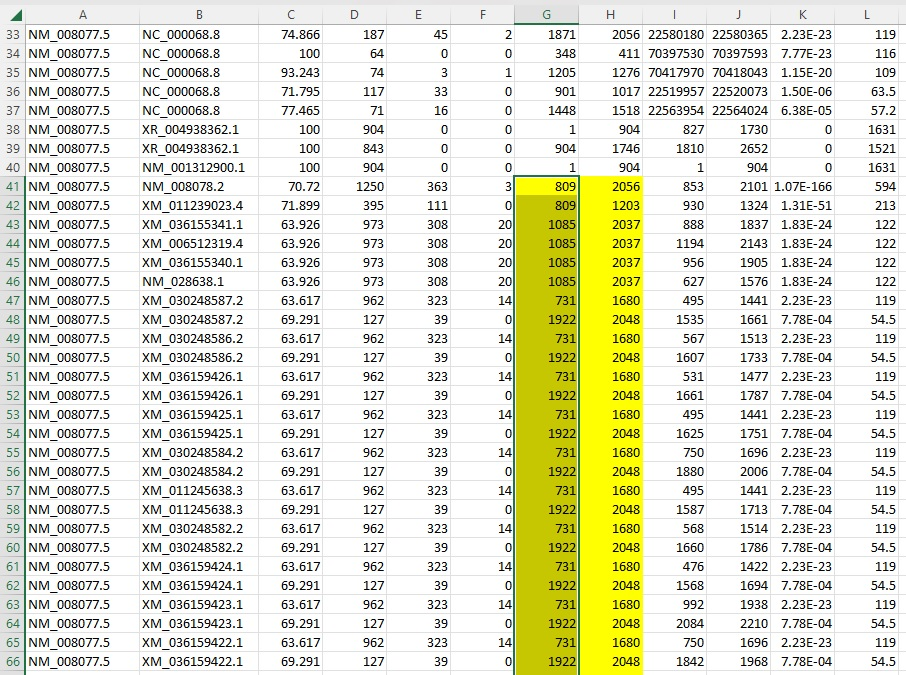

## 6. Run the MATLAB script and make a table

The script is "target_selection_ver1.m"

Example of Gad1

          sequence_length= 3283;
          rem_start=[809
          809
          1085
          1085
          1085
          1085
          731
          1922
          731
          1922
          731
          1922
          731
          1922
          731
          1922
          731
          1922
          731
          1922
          731
          1922
          731
          1922
          731
          1922
          731
          1922
          731
          1922
          731
          1922
          731
          1922
          731
          1922
          731
          1922
          731
          1922
          731
          1922
          731
          1922
          731
          1922
          731
          1922
          731
          1922
          731
          1922
          731
          1922
          731
          1922
          731
          1922
          731
          1922
          731
          1922
          731
          1922
          731
          1922
          731
          1922
          731
          1922
          1366
          1085
          1922
          1563
          731
          1922
          1563
          731
          1922
          1563
          731
          1922
          1563
          731
          1922
          1563
          731
          1922
          1563
          731
          1922
          1563
          731
          1922
          1563
          731
          1922
          1563
          904
          1922
          2248
          1565
          1448
          1922
          2262
          2262
          2262
          2263
          2261
          ];

          rem_end =[2056
          1203
          2037
          2037
          2037
          2037
          1680
          2048
          1680
          2048
          1680
          2048
          1680
          2048
          1680
          2048
          1680
          2048
          1680
          2048
          1680
          2048
          1680
          2048
          1680
          2048
          1680
          2048
          1680
          2048
          1680
          2048
          1680
          2048
          1680
          2048
          1680
          2048
          1680
          2048
          1680
          2048
          1680
          2048
          1680
          2048
          1680
          2048
          1680
          2048
          1680
          2048
          1680
          2048
          1680
          2048
          1680
          2048
          1680
          2048
          1680
          2048
          1680
          2048
          1680
          2048
          1680
          2048
          1680
          2048
          2037
          1683
          2037
          1680
          1039
          2048
          1680
          1039
          2048
          1680
          1039
          2048
          1680
          1039
          2048
          1680
          1039
          2048
          1680
          1039
          2048
          1680
          1039
          2048
          1680
          1039
          2048
          1680
          946
          2048
          2309
          1683
          1527
          2037
          2308
          2309
          2309
          2309
          2309
          ];

          [output_list, target_seq_column] = target_selection_ver1(sequence_length, rem_start, rem_end);

target_seq_column will be 
[1	730	2057	2247	2310	3283] 
(Result was done on 2022-12-14)

Copy the values to the target table

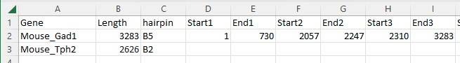

## 7. Repeat the process above and finish making a target region table

target_seq_column for Tph2 will be 
[1	328	1509	2626]. 
(Result was done on 2022-12-14)

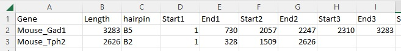

## 8. Run the probe design script to make whole probe sequence

          Example
          FASTA_dir= 'C:\Users\BIC_Laptop1\Desktop\Github_readme\Probe_design_introduction\FASTA_seq';
          out_dir= 'C:\Users\BIC_Laptop1\Desktop\Github_readme\Probe_design_introduction\out_dir'
          max_probe_number=50;
          Probelist is drag&drop the table you made and change the name to 'Probelist'.

          Run
          probe_design_main_Github(FASTA_dir, Probelist, out_dir, max_probe_number)

You will have the result shown in the picture

1. Probe_design_summary
2. Probe_list of each transcripts
3. opool excel file for ordering

## Probe_design_summary

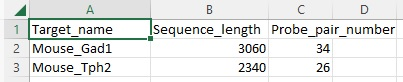

## Gad1 probe sequence
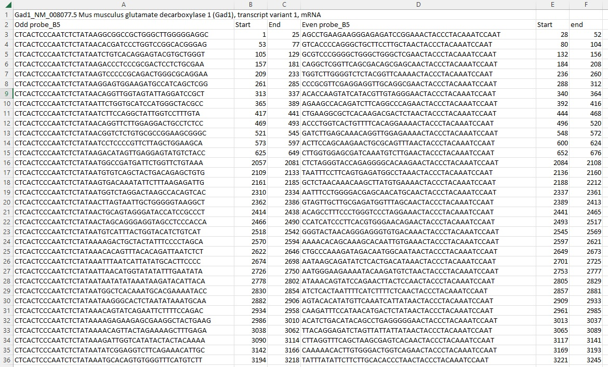

## Tph2 probe sequence
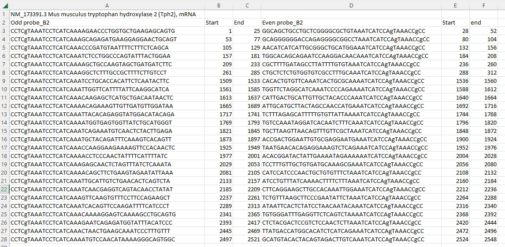

Reduced version has a smaller number of the probes.

The opool excel file generated can be used for ordering probe for IDT_DNA company.
